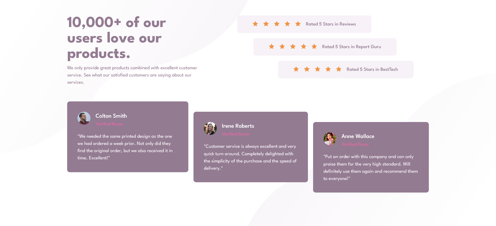

# Frontend Mentor - Social proof section solution
 
## Overview

### The challenge

Users should be able to:

- View the optimal layout for the section depending on their device's screen size

### Screenshot

 
### Links

- Solution URL: [Github](https://github.com/Shahzaib-ur-Rehman/social-proof-section)
- Live Site URL: [Social-Proof-Section](https://social-proof-section-sandy-iota.vercel.app/)

## My process

### Built with

- Semantic HTML5 markup
- CSS custom properties
- Flexbox
- CSS Grid
- Mobile-first workflow
 
## Author

- Website - [Shahzaib ur Rehman](https://www.linkedin.com/in/shahzaib-ur-rehman-2518b01b8/)
- Frontend Mentor - [@Shahzaib-ur-Rehman](https://www.frontendmentor.io/profile/Shahzaib-ur-Rehman)